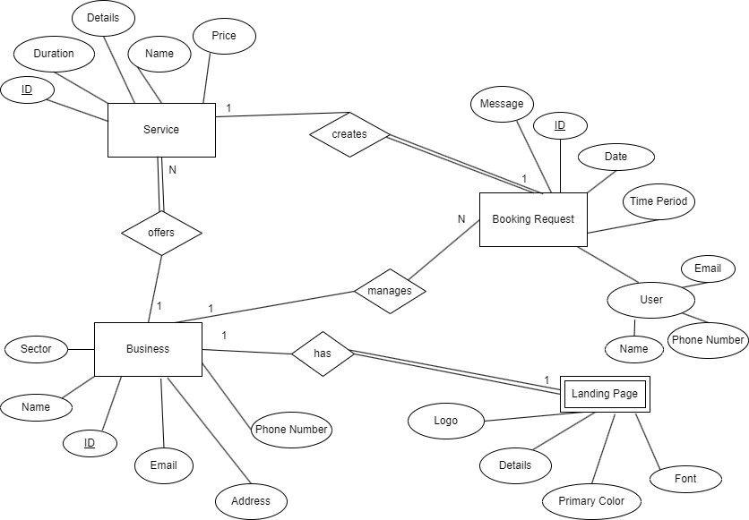
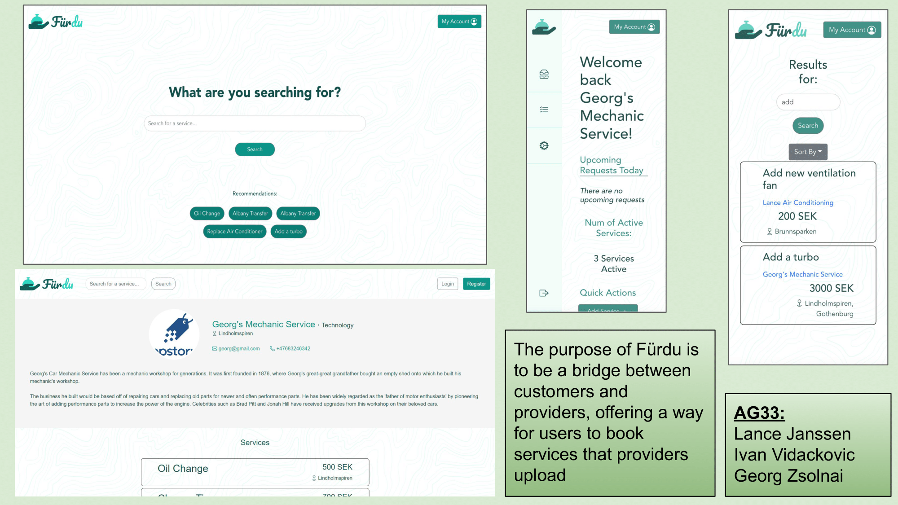

# Web Development Group Project 2022

A buisness provider platform that allows small businesses to advertise their services to standard users of our app. Thus, growing their small business and increasing their online precense in a simple, easy process. Users of the system are also greeted with the simplicity, as they do not have to create an account to get started: simply search the service you are looking for and book the service!

Link to webiste: [http://app.fuerdu.business/](http://app.fuerdu.business/) <br>
alt: [heroku link](https://lit-inlet-05101.herokuapp.com/)

### This project is an import from Chalmers Gitlab.

Latest version: https://git.ita.chalmers.se/courses/dit341/group-33-web (public Github [mirror](https://github.com/dit341/group-33-web))

<br>

# Backend and Frontend Template

## Project Structure

| File        | Purpose           | What you do?  |
| ------------- | ------------- | ----- |
| `server/` | Backend server code | All your server code |
| [server/README.md](server/README.md) | Everything about the server | **READ ME** carefully! |
| `client/` | Frontend client code | All your client code |
| [client/README.md](client/README.md) | Everything about the client | **READ ME** carefully! |
| [docs/DEPLOYMENT.md](docs/DEPLOYMENT.md) | Free online production deployment | Deploy your app online in production mode |
| [docs/LOCAL_DEPLOYMENT.md](docs/LOCAL_DEPLOYMENT.md) | Local production deployment | Deploy your app local in production mode |

## Requirements

The version numbers in brackets indicate the tested versions but feel free to use more recent versions.
You can also use alternative tools if you know how to configure them (e.g., Firefox instead of Chrome).

* [Git](https://git-scm.com/) (v2) => [installation instructions](https://www.atlassian.com/git/tutorials/install-git)
  * [Add your Git username and set your email](https://docs.gitlab.com/ce/gitlab-basics/start-using-git.html#add-your-git-username-and-set-your-email)
    * `git config --global user.name "YOUR_USERNAME"` => check `git config --global user.name`
    * `git config --global user.email "email@example.com"` => check `git config --global user.email`
  * > **Windows users**: We recommend to use the [Git Bash](https://www.atlassian.com/git/tutorials/git-bash) shell from your Git installation or the Bash shell from the [Windows Subsystem for Linux](https://docs.microsoft.com/en-us/windows/wsl/install-win10) to run all shell commands for this project.
* [Chalmers GitLab](https://git.ita.chalmers.se/) => Login with your **Chalmers CID** choosing "Sign in with" **Chalmers Login**. (contact [support@chalmers.se](mailto:support@chalmers.se) if you don't have one)
  * DIT341 course group: https://git.ita.chalmers.se/courses/dit341
  * [Setup SSH key with Gitlab](https://docs.gitlab.com/ee/ssh/)
    * Create an SSH key pair `ssh-keygen -t ed25519 -C "email@example.com"` (skip if you already have one)
    * Add your public SSH key to your Gitlab profile under https://git.ita.chalmers.se/profile/keys
    * Make sure the email you use to commit is registered under https://git.ita.chalmers.se/profile/emails
  * Checkout the [Backend-Frontend](https://git.ita.chalmers.se/courses/dit341/group-00-web) template `git clone git@git.ita.chalmers.se:courses/dit341/group-00-web.git`
* [Server Requirements](./server/README.md#Requirements)
* [Client Requirements](./client/README.md#Requirements)

## Getting started

```bash
# Clone repository
git clone git@git.ita.chalmers.se:courses/dit341/group-00-web.git

# Change into the directory
cd group-00-web

# Setup backend
cd server && npm install
npm run dev

# Setup frontend
cd client && npm install
npm run serve
```

> Check out the detailed instructions for [backend](./server/README.md) and [frontend](./client/README.md).

## Visual Studio Code (VSCode)

Open the `server` and `client` in separate VSCode workspaces or open the combined [backend-frontend.code-workspace](./backend-frontend.code-workspace). Otherwise, workspace-specific settings don't work properly.

## System Definition (MS0)

### Purpose

The aim of our system is to connect the service sector the potential customers. 
The service providers are able to create an account and a subsequent customizable landing page
that allows customers to see their business and any potential services the provide.
Users can search for and book these services on our platform to simplify the communication between them.
Service providers see a clear overview of their bookings which they can either decline, append or accept.
With this in mind, our society benefits from the global transformation to the online world, 
creating a safe and neutral environment for customers to contact service providers.

### Pages

- Home: On this page there will be search bar with quick-search buttons. Above there shall be registration and login buttons for new and existing service providers. Below the search bar it will show some brief information on who we are and what this webservice is and does. 
- Registration Page: On this page, service providers will fill out a form with a final submit button. 
- Service Provider Landing Page: This page, contains all information provided by the service provider. It is customized based on the settings from the service provider. Below the service provider's information, there is a list of services that the customer can create a booking for. 
- Configuration Page: This page contains the service provider's details and below contains the landing page's details. Both of which are customizable. 
- Search Results: This page contains a list of results based on the users input from the home page. 
- Booking Inbox: This page contains a list of booking for services registered by the service provider. The service provider can open such bookings and sees an overview of the booking's details as well as option to accept, decline or change the booking. 

### Entity-Relationship (ER) Diagram



## Teaser (MS3)


